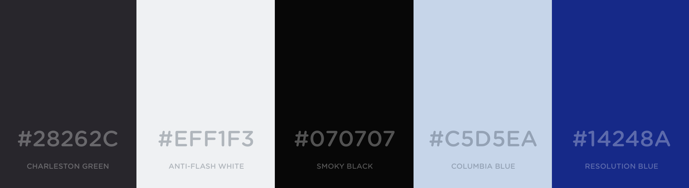

# dotWee.github.io

A simple introduction / portfolio site using [Jekyll](https://jekyllrb.com/) and some handcrafted stylesheets.

## Running

Installing dependencies: `$ npm install`

For local development: `$ npm run gulp` and open [./dist/index.html](./dist/index.html).

For deploying: `$ npm run build`

## Deployments

+ [dotwee.de](https://dotwee.de)
+ [dotwee.github.io](https://dotwee.github.io/)
+ [iamlukas.website](https://iamlukas.website/)

## Color scheme

([View online](https://coolors.co/28262c-eff1f3-070707-c5d5ea-14248a))

## Credits

+ [Nicolas Gallagher & Jonathan Neal](http://necolas.github.io/normalize.css/): for Normalize.css (MIT license)
+ The [HTML5 Boilerplate](https://html5boilerplate.com) for its base code

## License

Copyright (c) 2015 Lukas 'dotwee' Wolfsteiner
Licensed under the [_Do What The Fuck You Want To_](/LICENSE) public license