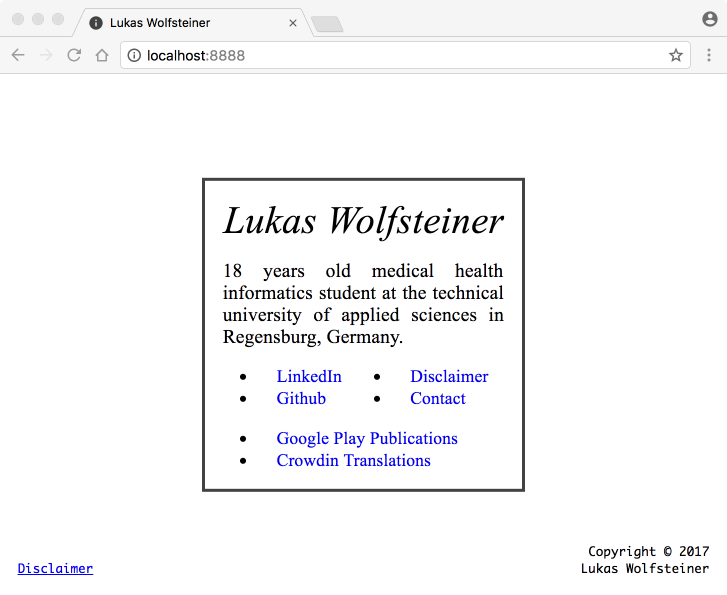

# dotwee.de / dotWee.github.io

Minimal personal website

## Features

+ Fully responsive, easily scalable and built with intelligent HTML5 and CSS3.
+ Aligned layout for mobile layouts (tablets as well as phones)
+ NoScript compatible (no Javascript used)
+ Very lightweight

## Screenshot

(May some commits behind)

## Live

+ [dotwee.de](https://dotwee.de)
+ [dotwee.github.io](https://dotwee.github.io/)
+ [iamlukas.website](https://iamlukas.website/)

## Credits

+ [Nicolas Gallagher & Jonathan Neal](http://necolas.github.io/normalize.css/): for Normalize.css (MIT license)

## License

Copyright (c) 2015 Lukas 'dotwee' Wolfsteiner
Licensed under the [_Do What The Fuck You Want To_](/LICENSE) public license