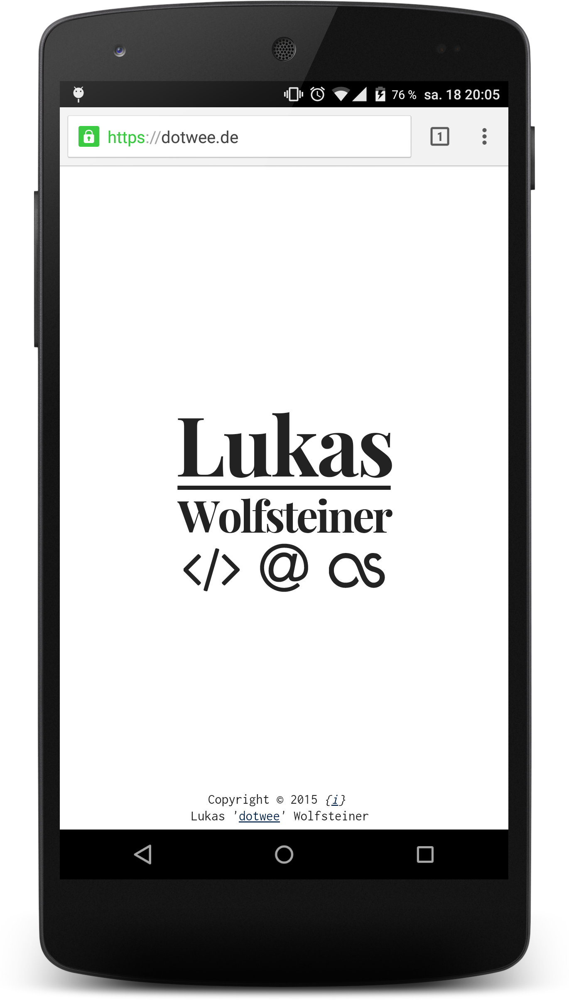

# dotWee.github.io / dotwee.de

Minimal personal website. Constantly work in progress.
See it live at [dotwee.de](https://dotwee.de) or [dotwee.github.io](http://dotwee.github.io/)

>Fully responsive, animated and built with intelligent HTML5 and CSS3.  
Runs without any single f 'ing line of Javascript.  
Just pure HTML and CSS.

Mobile layouts (tablets as well as phones, like the Nexus 7 or iPhone 5) are also in the stylesheets defined:

<table style="border: 0px;">
    <tr><td></td></tr>
</table>

## Credits

+ [Font Awesome](http://fortawesome.github.io/) : for their awesome icons
+ [Ghost](https://ghost.org) : for its inspiration (MIT license)
+ [Raph Levien](http://www.levien.com) : for his Inconsolata font (licensed under SIL Open Font)
+ [Nicolas Gallagher & Jonathan Neal](http://necolas.github.io/normalize.css/) : for Normalize.css (MIT license)
+ [Claus Eggers Sørensen](http://www.forthehearts.net) : for his Playfair Display font (licensed under SIL Open Font)

## License

Copyright (c) 2015 Lukas 'dotwee' Wolfsteiner
Licensed under the [_Do What The Fuck You Want To_](/LICENSE) public license